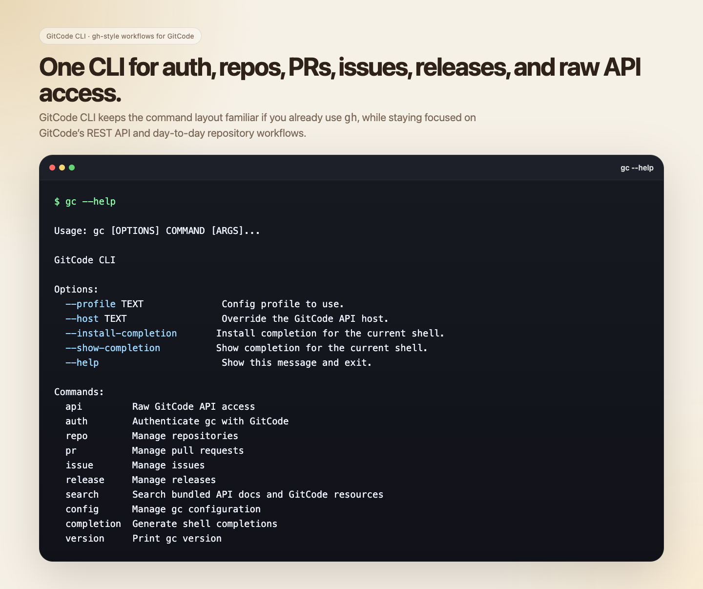
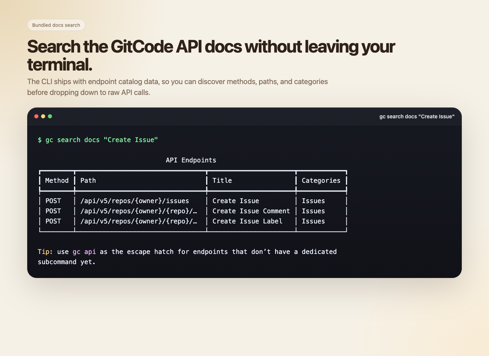
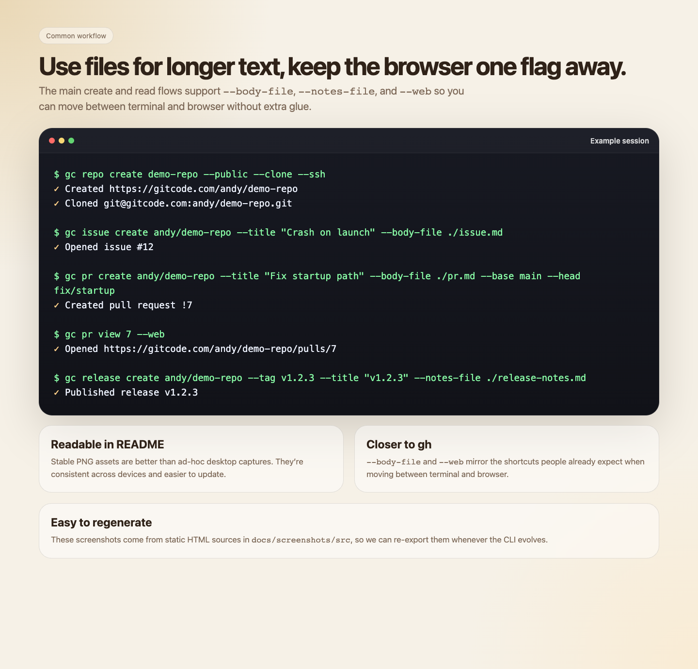

# GitCode CLI

`gc` is a GitHub CLI-style command line interface for GitCode.

It is designed to feel familiar if you already use `gh`, while staying focused on GitCode's REST API and workflows.



## Status

v1 focuses on the core command groups:

- `gc auth`
- `gc repo`
- `gc pr`
- `gc issue`
- `gc release`
- `gc api`
- `gc search`
- `gc config`
- `gc completion`

This is not a drop-in replacement for GitHub CLI. It follows the same command-line style, but targets GitCode.

## Install

### Homebrew

```bash
brew tap AndyKong2020/homebrew-tap
brew install AndyKong2020/tap/gitcode-cli
```

### Install Script

```bash
curl -fsSL https://raw.githubusercontent.com/AndyKong2020/gitcode-cli/main/install.sh | bash
```

Update:

```bash
curl -fsSL https://raw.githubusercontent.com/AndyKong2020/gitcode-cli/main/install.sh | bash -s -- update
```

Uninstall:

```bash
curl -fsSL https://raw.githubusercontent.com/AndyKong2020/gitcode-cli/main/install.sh | bash -s -- uninstall
```

## Quick Start

Authenticate once:

```bash
gc auth login
```

Check status:

```bash
gc auth status
```

List repositories:

```bash
gc repo list
```

Inspect the current repository from a cloned GitCode repo:

```bash
gc repo view
gc pr list
gc issue list
```

Create a repository and clone it immediately:

```bash
gc repo create my-demo --public --clone
gc repo create my-private-demo --clone --ssh
```

Open resources in the browser:

```bash
gc repo view my-org/my-repo --web
gc pr view 12 --web
gc issue view 34 --web
gc release view v1.2.3 --web
```

Create issues, PRs, and comments from markdown files:

```bash
gc issue create my-org/my-repo --title "Bug report" --body-file ./issue.md
gc pr create my-org/my-repo --title "Refactor parser" --body-file ./pr.md --base main --head feature/parser
gc pr comment 12 my-org/my-repo --body-file ./review-comment.md
gc release create my-org/my-repo --tag v1.2.3 --title "v1.2.3" --notes-file ./release-notes.md
```



Search GitCode API docs bundled with the CLI:

```bash
gc search docs "Create Issue"
```

Use the raw API escape hatch:

```bash
gc api /api/v5/user
gc api /api/v5/repos/{owner}/{repo} -P owner=my-org -P repo=my-repo
```

## Authentication

`gc` resolves the token in this order:

1. `GITCODE_TOKEN`
2. the selected profile in `~/.config/gc/config.toml`
3. a system-backed secret store

On macOS it uses Keychain via `security`.
On Linux it uses `secret-tool` when available.
If no system secret store is available, `gc auth login` can still persist the token in config.

## Configuration

Config lives at:

```text
~/.config/gc/config.toml
```

Examples:

```bash
gc config list
gc config get defaults.profile
gc config set defaults.owner AndyKong2020
gc config set profiles.work.host https://api.gitcode.com
```

## Common Workflows

Review a repository from inside a local clone:

```bash
gc repo view
gc pr list --limit 10
gc pr view 7
gc pr checkout 7
```

Work against another repository without changing directories:

```bash
gc issue list my-org/my-repo
gc pr list my-org/my-repo --json
gc release list my-org/my-repo
```

Use `gc api` as the escape hatch when a dedicated command is missing:

```bash
gc api /api/v5/repos/{owner}/{repo}/branches -P owner=my-org -P repo=my-repo
gc api /api/v5/repos/{owner}/{repo}/hooks -P owner=my-org -P repo=my-repo
```



## Shell Completion

```bash
gc completion zsh
gc completion bash
gc completion fish
```

## Docs

- [Install details](docs/INSTALL.md)
- [Authentication details](docs/AUTH.md)
- [gh-style behavior and differences](docs/GH_DIFFERENCES.md)
- [Command examples](docs/COMMANDS.md)

## Screenshot Sources

The README screenshots are generated from static HTML sources in `docs/screenshots/src/`.
